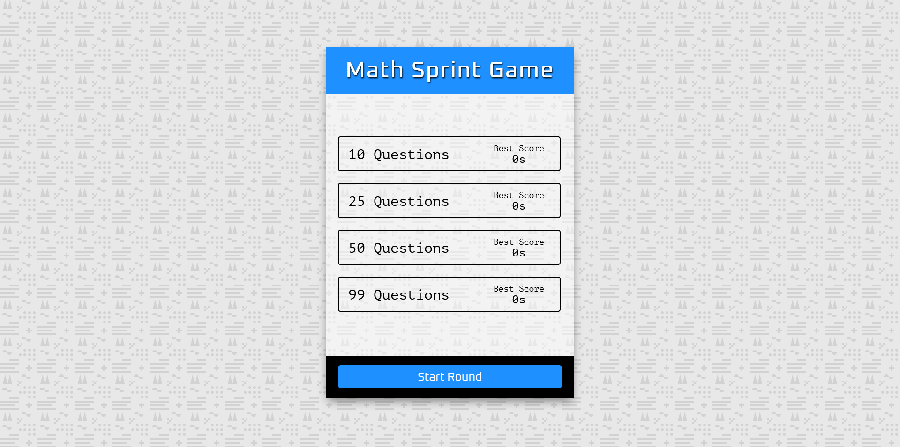

# Math Sprint Game

The Math Sprint Game is an engaging, interactive, and responsive game designed to test and improve your mental math skills. Built with HTML, CSS, and JavaScript, the game challenges players to solve as many correct equations as possible within the shortest time.

This project was developed as part of the course "JavaScript Web Projects: 20 Projects to Build Your Portfolio" by Zero To Mastery.

## Table of contents

- [Math Sprint Game](#math-sprint-game)
  - [Table of contents](#table-of-contents)
  - [Overview](#overview)
    - [Screenshot](#screenshot)
    - [Links](#links)
    - [How to Play](#how-to-play)
    - [Built with](#built-with)
    - [What I learned](#what-i-learned)
    - [Useful resources](#useful-resources)
  - [Author](#author)
  - [Acknowledgments](#acknowledgments)

## Overview

The Math Sprint Game combines speed and accuracy by challenging players to solve math equations. It includes:
- Dynamic difficulty levels: Players can select from 10, 25, 50, or 99 questions per round.
- Score tracking: Tracks and displays the best scores for each difficulty level.
- Real-time feedback: Players can quickly determine if their answers are correct or incorrect.
- Countdown and timer: Includes a countdown before the game begins and a timer to measure the player's performance.
- Responsive design: Optimized for desktop and mobile devices.

### Screenshot



### Links

- Live Site URL: [DT Code](https://math-sprint-game.dtcode.se/)

### How to Play

1. Choose the number of questions for the round (10, 25, 50, or 99).
2. The game starts with a countdown from 3.
3. Solve the equations by selecting Right or Wrong.
4. Try to finish the round as quickly as possible while maintaining accuracy.
5. Your time is displayed at the end, including a penalty for incorrect answers.
6. Compare your score with the best score and try to improve it!

### Built with

- HTML5: Semantic structure for the game's interface.
- CSS3:
  - Responsive styling using Flexbox and media queries.
  - Modern UI with CSS variables and animations.
- JavaScript (ES6+):
  - Dynamic equation generation and evaluation.
  - Timer and score tracking functionality.
  - Local storage for best score persistence.

### What I learned

While building this project, I improved my skills in:
- Implementing dynamic gameplay logic, including random equation generation and score penalties for incorrect answers.
- Managing time-based functionality, such as timers and intervals.
- Using localStorage to save and retrieve high scores for each difficulty level.
- Optimizing for performance and responsiveness across devices.

The following example demonstrates how the game dynamically generates and displays equations in the DOM: 

```js
// Create Correct/Incorrect Random Equations
function createEquations() {
  const correctEquations = Math.floor(Math.random() * questionAmount);
  const wrongEquations = questionAmount - correctEquations;

  for (let i = 0; i < correctEquations; i++) {
    firstNumber = Math.floor(Math.random() * 9);
    secondNumber = Math.floor(Math.random() * 9);
    const equationValue = firstNumber * secondNumber;
    equationsArray.push({ value: `${firstNumber} x ${secondNumber} = ${equationValue}`, evaluated: 'true' });
  }

  for (let i = 0; i < wrongEquations; i++) {
    firstNumber = Math.floor(Math.random() * 9);
    secondNumber = Math.floor(Math.random() * 9);
    const wrongValue = firstNumber * secondNumber + Math.floor(Math.random() * 10 - 5);
    equationsArray.push({ value: `${firstNumber} x ${secondNumber} = ${wrongValue}`, evaluated: 'false' });
  }

  shuffle(equationsArray);
}
```

This code dynamically creates random math equations, differentiates correct ones from incorrect ones, and shuffles them for display.

### Useful resources

- [MDN: Math.random()](https://developer.mozilla.org/en-US/docs/Web/JavaScript/Reference/Global_Objects/Math/random) - Used for generating random computer choices.
- [MDN: localStorage](https://developer.mozilla.org/en-US/docs/Web/API/Window/localStorage) - Utilized for saving best scores.

## Author

- GitHub - [@dantvi](https://github.com/dantvi)
- LinkedIn - [@danieltving](https://www.linkedin.com/in/danieltving/)

## Acknowledgments

Special thanks to Zero To Mastery for the inspiration and structured guidance through the course. Thanks also to MDN Web Docs for their comprehensive documentation and examples.
